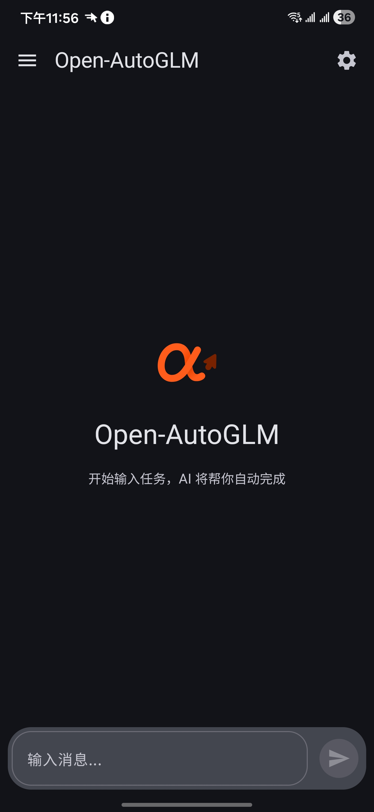
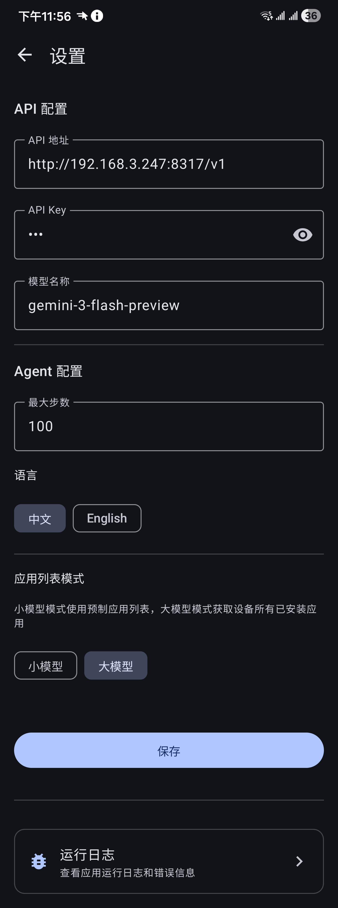
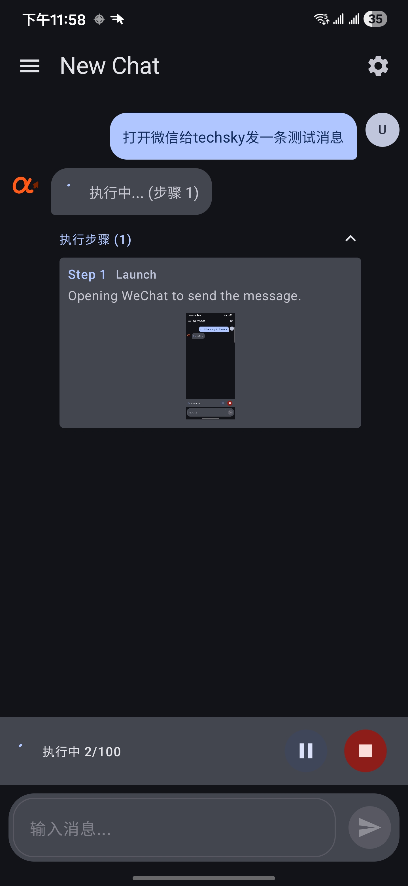
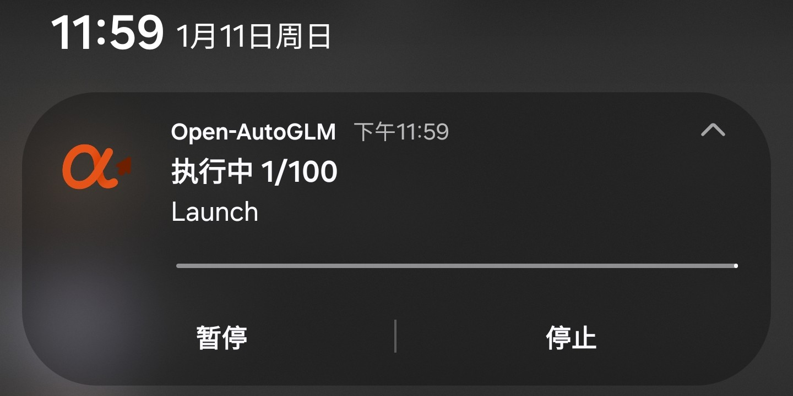
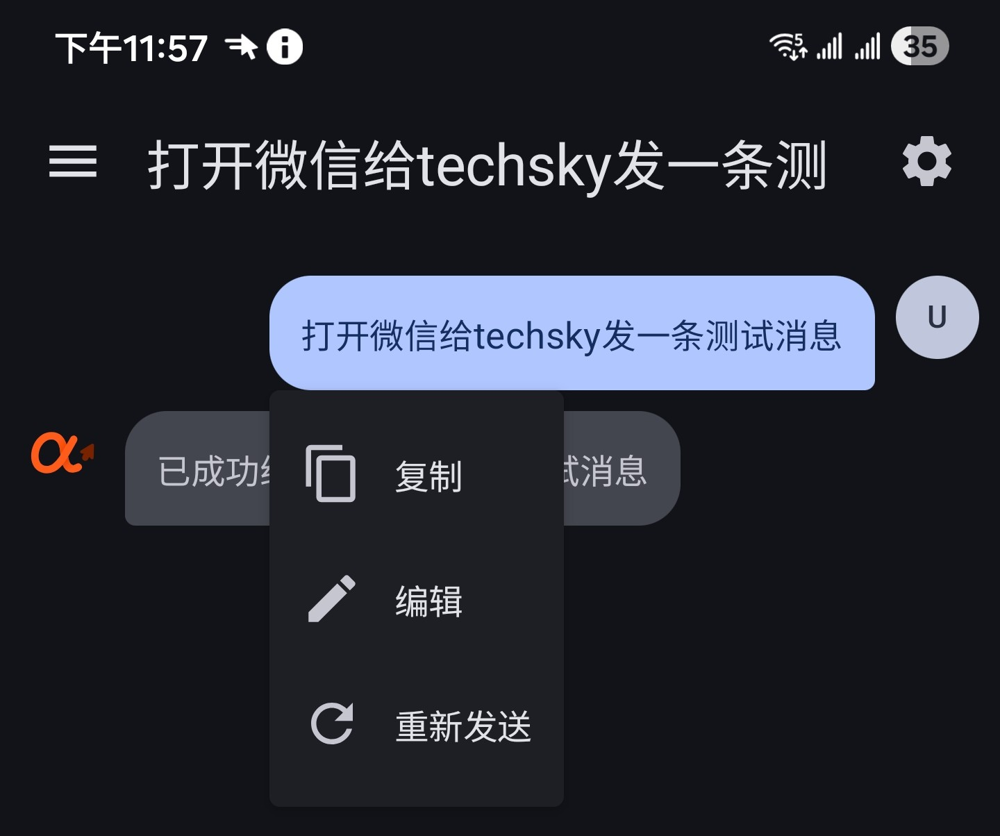
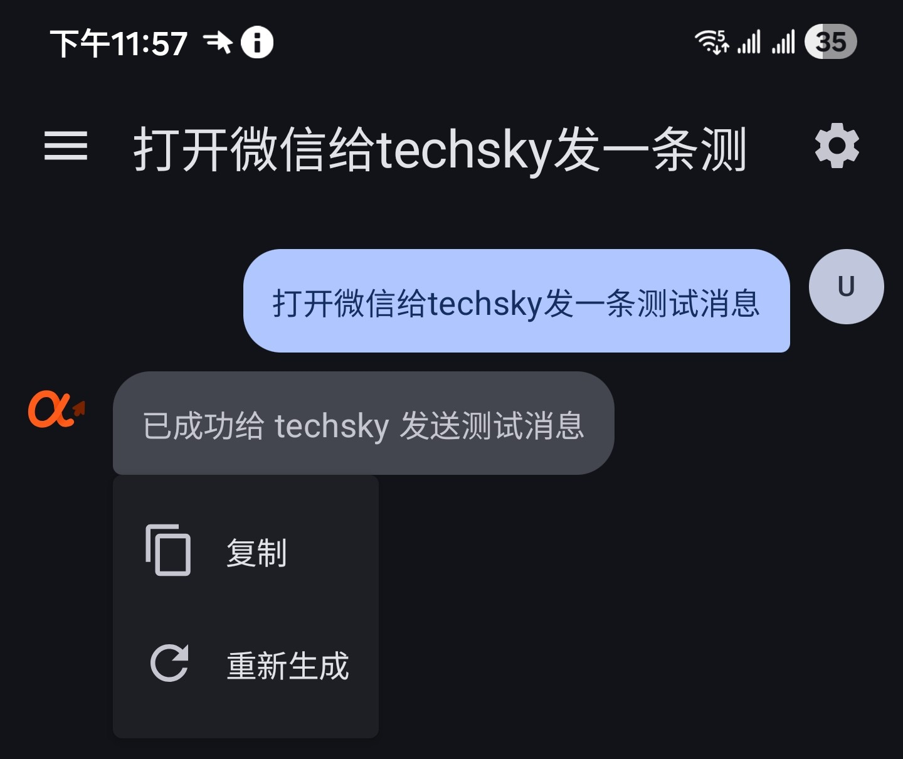

# Open-AutoGLM-Android

<p align="center">
  
</p>

<p align="center">
  <strong>AI 驱动的 Android 手机自动化操控</strong>
</p>

<p align="center">
  <a href="https://github.com/butlanys/Open-AutoGLM-Android/releases"></a>
  <a href="https://github.com/butlanys/Open-AutoGLM-Android/blob/main/LICENSE"></a>
  
</p>

---

基于 [Open-AutoGLM](https://github.com/zai-org/Open-AutoGLM) 的 Android 原生客户端，通过 Shizuku 实现完全本地化的 AI 手机操控，无需电脑连接。

写在前头，此项目受 [Open-AutoGLM](https://github.com/zai-org/Open-AutoGLM) 项目启发，项目代码完全由Claude编写，但方案设计百分百原创，我在事先除了参考过Open-AutoGLM、scrcpy、shizuku-api的代码外，没有看过其他开发者的代码。shizuku方案是因为我日常用的多才采用，~~绝不是因为无障碍太容易被app检测到导致被ban号~~

## ✨ 特性

- 📱 **纯手机端运行** - 无需电脑连接 ADB，通过 Shizuku 直接获取 shell 权限
- 🎨 **Material Design 3** - 现代化 UI，支持动态取色 (Material You)
- 🤖 **多模型兼容** - 支持任何具有图像输入能力的 AI 模型
- ⚡ **流式响应** - 实时显示 AI 思考过程
- 🔒 **敏感操作确认** - 支付、删除等操作需用户确认
- 🛠️ **人工接管** - 登录、验证码等场景支持人工介入

## 📸 UI 截图

| 主页 | 设置页 |
|:---:|:---:|
|  |  |
| 对话中 | 通知栏显示进度 |
|  |  |
| 用户对话编辑 | ai对话编辑 |
|  |  |

<small><del>感谢Tech_sky的友情支持</del></small>

## 📋 系统要求

- Android 8.0+ (API 26+)
- [Shizuku](https://shizuku.rikka.app/) 已安装并运行
- (可选) [ADB Keyboard](https://github.com/senzhk/ADBKeyBoard) 用于中文输入

## 📦 安装

### 方式一：下载 Release

前往 [Releases](https://github.com/butlanys/Open-AutoGLM-Android/releases) 下载最新版本 APK

### 方式二：自行编译

```bash
git clone https://github.com/butlanys/Open-AutoGLM-Android.git
cd Open-AutoGLM-Android
./gradlew assembleDebug
```

## 🔧 配置

### 1. 安装 Shizuku

1. 下载并安装 [Shizuku](https://shizuku.rikka.app/)
2. 按照 Shizuku 说明启动服务（无线调试或 Root）
3. 打开本应用，授予 Shizuku 权限

### 2. 配置 AI API

在应用设置页面配置 API 信息：

#### 智谱 BigModel (推荐)

| 配置项 | 值 |
|--------|-----|
| API 地址 | `https://open.bigmodel.cn/api/paas/v4` |
| 模型名称 | `autoglm-phone` |
| API Key | 在 [智谱开放平台](https://bigmodel.cn/) 申请 |

#### ModelScope

| 配置项 | 值 |
|--------|-----|
| API 地址 | `https://api-inference.modelscope.cn/v1` |
| 模型名称 | `ZhipuAI/AutoGLM-Phone-9B` |
| API Key | 在 [ModelScope](https://modelscope.cn/) 申请 |

### 🔌 API 兼容性

本应用支持任何**具有图像输入能力**且兼容 OpenAI API 格式的模型。

如果你想使用其他模型（如 Claude、Gemini、通义千问等），可以使用 [CLIProxyAPI](https://github.com/router-for-me/CLIProxyAPI) 进行 API 格式转换：

```bash
# 使用 CLIProxyAPI 将其他模型 API 转换为 OpenAI 兼容格式
# 然后将转换后的地址填入本应用的 API 设置中
```

**兼容的模型要求：**
- ✅ 支持图像输入（Vision 能力）
- ✅ 支持 OpenAI Chat Completions API 格式
- ✅ 支持流式响应 (SSE)

## 🚀 使用方法

1. 确保 Shizuku 运行且已授权
2. 在设置页配置 API
3. 在主页输入任务，例如：
   - "打开微信搜索附近美食"
   - "打开淘宝搜索无线耳机"
   - "打开设置调整屏幕亮度"
   - "帮我发一条朋友圈"
4. 点击开始执行

## 📋 支持的操作

| 操作 | 说明 |
|------|------|
| `Launch` | 启动应用 |
| `Tap` | 点击屏幕坐标 |
| `Type` | 输入文本 |
| `Swipe` | 滑动手势 |
| `Back` | 返回键 |
| `Home` | 回到桌面 |
| `Long Press` | 长按 |
| `Double Tap` | 双击 |
| `Wait` | 等待指定时间 |
| `Take_over` | 请求人工接管 |

## 🏗️ 项目结构

```
app/src/main/java/com/autoglm/android/
├── action/           # Action 解析与执行
├── agent/            # Agent 核心逻辑 (PhoneAgent)
├── config/           # 配置 (系统提示词、应用包名等)
├── data/             # 数据持久化 (DataStore)
├── device/           # 设备控制 (截图、点击、滑动等)
├── model/            # AI 模型客户端
├── service/          # 前台服务
├── shizuku/          # Shizuku 集成 (UserService)
└── ui/               # Jetpack Compose UI
```

## 🛡️ 安全说明

- 所有敏感操作（支付、删除等）需要用户手动确认
- 本应用不会上传任何个人数据
- 截图仅用于 AI 分析，不会存储或传输到第三方
- API Key 仅存储在本地设备

## 📄 许可证

本项目仅供学习研究使用。

## 🙏 致谢

- [Open-AutoGLM](https://github.com/zai-org/Open-AutoGLM) - 原始项目
- [Shizuku](https://github.com/RikkaApps/Shizuku) - Shell 权限框架
- [scrcpy](https://github.com/Genymobile/scrcpy) - 屏幕捕获技术参考 (Apache License 2.0)
- [CLIProxyAPI](https://github.com/router-for-me/CLIProxyAPI) - API 转换工具
